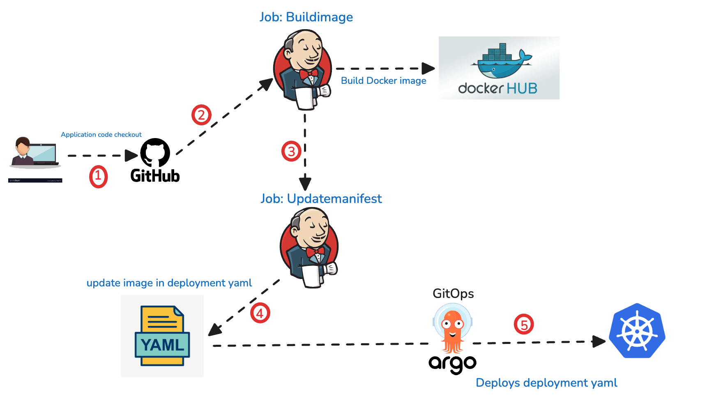

# CI/CD Pipeline with Jenkins and GitOps (ArgoCD)

## Project Overview: 
Implementing a modern CI/CD pipeline that dockerizes code and deploys to Kubernetes using GitOps principles.

Gitops is not a replacemnt for devops, it acts like a compelentary for devops. In a traditional cicd pipeline works in a push mechansima nd while Gitops works pull based, where GIT acts like a single source of truth and it continously synchrozie wit the cluster agisnt to the repository changes, if any drifts it ensure the desired status is actully maintained.

Example: If someone manually changes the resources in the cluster, ArgoCD detects it and ensure the state matching it with git repo.

## Advantages
1. Git as Single Source of Truth: version controlled and easy rollbacks 
2. Automated State Management: auto reconciliation and drift detection 
3. Enhanced Security: Clear isolation between CI and CD access control
4. Streamlined Operations: simplified deployment, better visibility and less operation overhead.

## Steps:
* CI Pipeline Setup (Jenkins): create a job for with jenkinsfile for CI- to build the docker image with build number as tag and push to dockerhub, configure web hook trigger.

* CD Pipeline Setup (ArgoCD): Deploy EKS cluster with managed node groups, Install ArgoCD in the cluster, Configure ArgoCD dashboard,Create application stack with source and destination configs.

* Deployment Verification: Post deployment, verify the pod status and ensure all are running and expose service of type loadbalncer and finally verify application accessibility from browser 

## ISSUES FACED:

Pod CrashLoopBackOff due to Flask dependency conflict: Incompatible Werkzeug library version.

### Solution: 
Updated Flask to version 2.2.2, Werkzeug to version 2.3.7 to make it compatible and had to rebuild the image and deploy the container into the cluster.
