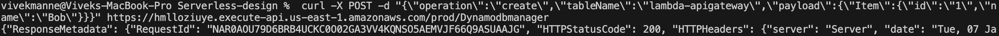

# Serverless Lab and High level Design 


An Amazon API Gateway is a collection of resources and methods. For this tutorial, you create one resource (`DynamoDBManager`) and define one method (`POST`) on it. The method is backed by a Lambda function (`LambdaFunctionOverHttps`). That is, when you call the API through an HTTPS endpoint, Amazon API Gateway invokes the Lambda function.

The POST method on the `DynamoDBManager` resource supports the following DynamoDB operations:

Create, update, and delete an item.
Read an item.
Scan an item.
Other operations (echo, ping), not related to DynamoDB, that you can use for testing.

## Setup

1. Create the execution role that gives your function permission to access AWS resources.
2. Create a role with the following custom policy permissions attached to the role.

        {
        "Version": "2012-10-17",
        "Statement": [
        {
        "Sid": "Stmt1428341300017",
        "Action": [
            "dynamodb:DeleteItem",
            "dynamodb:GetItem",
            "dynamodb:PutItem",
            "dynamodb:Query",
            "dynamodb:Scan",
            "dynamodb:UpdateItem"
        ],
        "Effect": "Allow",
        "Resource": "*"
        },
        {
        "Sid": "",
        "Resource": "*",
        "Action": [
            "logs:CreateLogGroup",
            "logs:CreateLogStream",
            "logs:PutLogEvents"
        ],
        "Effect": "Allow"
        }
        ]
        }

    

3. Create Lambda Function of name `LambdaFunctionOverHttps` , select `Python 3.7` as Runtime. Use an existing role that we created.


4. Example Python code

    ```from __future__ import print_function

    import boto3
    import json

    print('Loading function')


    def lambda_handler(event, context):
        '''Provide an event that contains the following keys:

        - operation: one of the operations in the operations dict below
        - tableName: required for operations that interact with DynamoDB
        - payload: a parameter to pass to the operation being performed
        '''
        #print("Received event: " + json.dumps(event, indent=2))

        operation = event['operation']

        if 'tableName' in event:
            dynamo = boto3.resource('dynamodb').Table(event['tableName'])

        operations = {
            'create': lambda x: dynamo.put_item(**x),
            'read': lambda x: dynamo.get_item(**x),
            'update': lambda x: dynamo.update_item(**x),
            'delete': lambda x: dynamo.delete_item(**x),
            'list': lambda x: dynamo.scan(**x),
            'echo': lambda x: x,
            'ping': lambda x: 'pong'
        }

        if operation in operations:
            return operations[operation](event.get('payload'))
        else:
            raise ValueError('Unrecognized operation "{}"'.format(operation))```

5. Create the DynamoDB table that the Lambda function uses with table name `lambda-apigateway` and primarykey is `Id(string)`

    


6. Create API with name `DynamoDBOperations` of type `REST API` 
   Each API is collection of resources and methods that are integrated with backend HTTP endpoints, Lambda functions, or other AWS services. 
   Create Resource with "`DynamoDBManager`" as the Resource Name
   Create a `POST` method for our API.
   While integrating with Lambda, add resource policy to the lambda to be invoked by this API.

   


7. Deploy the API that we created to a stage called "prod"


8. Finally, pick up the API endpoint url

   

### The APIGateway-Lambda-DynamoDB integration is done!!

## Running our solution:

1. The Lambda function supports using the create operation to create an item in your DynamoDB table. To request this operation, use the following JSON:

    {
    "operation": "create",
    "tableName": "lambda-apigateway",
    "payload": {
        "Item": {
            "id": "1234ABCD",
            "number": 5
        }
    }
} 

        
    


2. To execute our API from local machine, we are going to use Postman and Curl command. You can choose either method based on your convenience and familiarity.

   To run this from Postman, select "POST" , paste the API invoke url. Then under "Body" select "raw" and paste the above JSON. Click "Send". API should execute and return "HTTPStatusCode" 200.


3. validate that the item is indeed inserted into DynamoDB table, go to Dynamo console, select "lambda-apigateway" table, select "Items" tab, and the newly inserted item should be displayed.


4. Similary, To get all the inserted items from the table, we can use the "list" operation of Lambda using the same API. Pass the following JSON to the API, and it will return all the items from the Dynamo table

    {
        "operation": "list",
        "tableName": "lambda-apigateway",
        "payload": {
        }
    }

    
    
 


5. Cleaning up DynamoDB table, Lambda function and api-gateway as well.